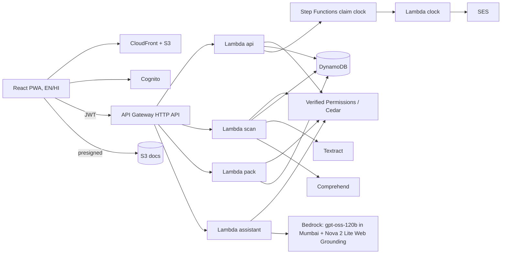

# AfterLoss

**Find, claim and follow up on what a loved one left behind.** Built during the WeMakeDevs × AWS **First Commit** hackathon (Bharat Builds Tour), 17–20 Sep 2026.

**Live app:** https://d30k8rjq3ol5ah.cloudfront.net · **Progress log:** [`docs/PROGRESS.md`](docs/PROGRESS.md)

## The problem

When a parent dies in India, the family (often a student) faces three problems:
- They don't know what exists: shares, mutual funds, an old FD, a PMJJBY cover.
- They fill the same details into form after form.
- They wait on banks with no idea of their rights.

Since RBI's **Settlement of Claims in respect of Deceased Customers of Banks Directions, 2025** (RBI/2025-26/82), the rules are standard:
- fixed claim forms (Annex I-A to I-H)
- no court papers needed up to ₹15 lakh (₹5 lakh at co-op banks) (para 10(a))
- settlement within **15 days** of complete documents (para 31)
- **interest at Bank Rate + 4%** if the bank is late (para 33)

Most families never hear about any of this.

## What it does

| Step | What happens | How |
|---|---|---|
| **Guided setup** | Seven steps in the order the forms need facts: about them → family and legal heirs → who gets paid → their bank accounts → investments and policies → find unknown assets → choose what to claim. Format checks while typing (PAN, IFSC with lookup, mobile, PIN, demat ID, UAN, PRAN). | React wizard; each fact entered once ([`docs/FLOW.md`](docs/FLOW.md)) |
| **Passbook photo** | Snap the first page of a passbook or FD receipt: bank, branch, IFSC, account number, customer ID and nomination are filled in for the family to check. | **Amazon Textract** + rows rebuilt from word boxes + deterministic parsing |
| **Find** | Upload a bank statement. Dividends reveal shares, SIPs reveal mutual funds, premiums reveal insurance, and a ₹436 debit reveals ₹2 lakh of PMJJBY cover. | pdfplumber/CSV parser + explainable detectors + fuzzy dictionaries; Textract for scans |
| **Search** | Prefilled kits for the official portals (unified portal, RBI UDGAM, SEBI MITRA, IEPF, insurers, EPFO) with name variants. They mostly find money dormant 7–10+ years, so we're honest about that. | Search-kit generator |
| **Route** | Each asset gets its route (nominee / simplified / above threshold / will / dispute / locker) with the **exact RBI paragraph quoted**. | Rules stored as data, each quote checked against the hashed RBI text |
| **Fill** | One tap produces a claim pack. For banks, RBI's Annex forms are printed **on the official form pages themselves** (tick boxes ticked, non-applicable options struck, amount in words). For MF, shares, insurance, PF, NPS and small savings: a plan sheet and a pre-filled claim letter. | pypdf overlay on the official template (hash-checked) + reportlab; Textract + Comprehend for masking |
| **Plan** | Every asset gets a numbered plan: what applies (with the rule and source), documents (tick what you have, "how to get it" for the rest), forms, who signs and what needs stamp paper, where to submit, and a tracker. | Playbooks as data from SEBI, AMFI, IRDAI, EPFO and India Post sources |
| **Guides** | Missing a document? Death certificate (incl. late registration), legal heir and succession certificates, probate, stamp paper, notary, affidavits: who issues it, steps, time, cost. | `guides.json` + web-grounded "ask for my state" |
| **Follow up** | Upload the bank's acknowledgement and a 15-day clock starts. Reminders on day 10 and 14. If late, compensation is calculated and the letter to the bank drafted. Once the family says they sent it, a 30-day reply period starts; if unresolved, an RBI Ombudsman draft. | Step Functions with callback tokens |
| **Ask** | "Explain in simple words" (English/Hindi), or search the web with citations. Personal data is stripped first. | Bedrock: explanations with **OpenAI gpt-oss-120b in Mumbai** (stays in India); web search with **Amazon Nova 2 Lite + Nova Web Grounding** |
| **Family** | Lead, heirs and helpers. Helpers see masked previews only and can never download originals. | **Amazon Verified Permissions (Cedar)** `forbid` policy |

## Architecture



Full details are in [`docs/ARCHITECTURE.md`](docs/ARCHITECTURE.md): the data model, API, security, cost, and the choices we made (e.g. no OpenSearch Serverless, no SMS until DLT registration).

## Proof it works

- `backend/tests`: **108 unit tests**. They cover:
  - every RBI route, including both threshold boundaries
  - compensation maths: ₹3.2 lakh, 10 days late at 9.5% = ₹832.88
  - discovery: all 16 planted assets found, no false positives
  - forms on the official pages, claim letters, passbook parsing, playbook slabs (MF ₹5/10 lakh, demat ₹15 lakh, Form-11 ₹5 lakh), masking, the PII firewall, assistant jobs
  - Cedar policies validated with `cedarpy`, with a 28-case decision matrix
- `python -m afterloss.rules.verify` re-hashes the RBI source and confirms **27/27 quotes appear word for word**.
- `scripts/e2e.py`: **24/24 live checks** on AWS (scan, route, pack, masking, Cedar denials, helper redaction, outdated packs, full clock → letter → complaint sent → Ombudsman draft, grounded answer with citations).

## Run it

```powershell
# backend (needs `aws login --profile afterloss`)
powershell -File scripts/deploy-backend.ps1
# website
powershell -File scripts/deploy-web.ps1
# local dev against the deployed API
npm --prefix frontend run dev
# tests
cd backend; $env:PYTHONPATH="src"; python -m pytest tests
node frontend/tests/gmailScan.test.ts
```

Android later: `cd frontend; npx cap add android; npx cap sync; npx cap open android`.

## Docs

[PRD](docs/PRD.md) · [Architecture](docs/ARCHITECTURE.md) · [What we learned](docs/LEARNINGS.md) · [Hackathon checklist](docs/HACKATHON.md) · [Setup](docs/SETUP.md) · [Progress](docs/PROGRESS.md)

## AI tools used

- **Claude Code** (Anthropic, Claude Opus 5): research, planning, code and docs, reviewed by the team.
- **Amazon Nova 2 Lite** on Amazon Bedrock inside the product: explanations and grounded web answers.

## Credits and data

- RBI notification text (RBI/2025-26/82), stored with its SHA-256 in `sources/` for citation checks.
- The sample bank statement and ID image are **synthetic** (see `samples/`).
- Fonts: Noto Sans (SIL OFL).
- Icons: Lucide (ISC).

## Disclaimer

Not legal advice. Rules are cited from official sources. Confirm with the bank or institution before signing.
