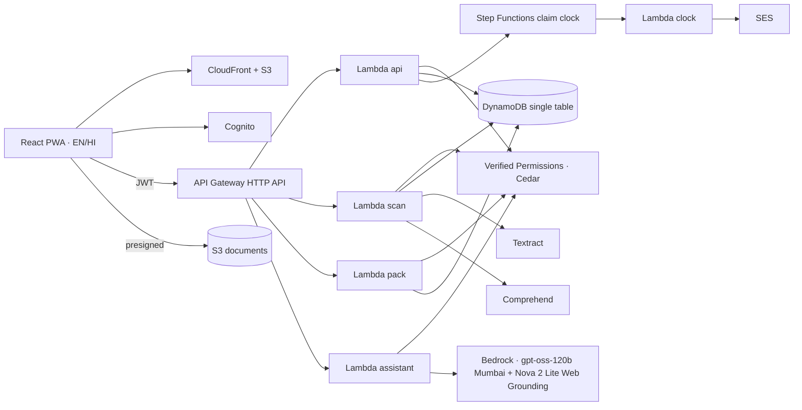

# AfterLoss

**Find, claim and follow up on what a loved one left behind.**

A bilingual (English / हिंदी) web application that helps an Indian family discover a deceased person's
financial assets, produce the official claim paperwork, and hold each institution to the deadlines the
regulator already gives them.

**Live application:** https://d30k8rjq3ol5ah.cloudfront.net
**Documentation:** [Architecture](docs/ARCHITECTURE.md) · [Deployment](docs/DEPLOYMENT.md)

---

## Overview

When a parent dies in India, the family — often a student — runs into the same three walls: they do not
know what the person owned, they fill the same details into form after form, and they wait on banks with
no idea of their rights.

Since the Reserve Bank of India issued the **Settlement of Claims in respect of Deceased Customers of
Banks Directions, 2025** (RBI/2025-26/82), the bank part of that process is rule-based:

| Rule | What it says |
|---|---|
| Annex I-A to I-H | One standard set of claim forms across every bank |
| Para 10(a) | No court papers up to ₹15 lakh (₹5 lakh at co-operative banks) |
| Para 31 | Settlement within **15 calendar days** of complete documents |
| Para 33 | **Interest at Bank Rate + 4%** for delays the bank causes |

AfterLoss turns those directions, and the equivalent rules for mutual funds, shares, insurance, provident
fund, pension and small savings, into a guided process: every decision it makes quotes the paragraph it
came from, and every quote is checked against a hashed copy of the official source.

## Capabilities

| | |
|---|---|
| **Guided intake** | Facts are collected once, in the order the official forms need them: the deceased, family and legal heirs, who is to be paid, bank accounts, investments and policies. Inline validation for PAN, IFSC (with branch lookup), UAN, PRAN and demat IDs. |
| **Discovery from documents** | A bank statement is parsed for evidence of assets nobody knew about — dividends reveal shares, SIP debits reveal mutual funds, a ₹436 premium reveals ₹2 lakh of PMJJBY cover. A passbook photograph fills in bank, branch, IFSC, account number and nomination. |
| **Discovery from email** | With the family's consent, a read-only Gmail search runs **entirely in the browser** and lists institutions that wrote to the deceased, each finding shown with the message it came from. Nothing but the confirmed result reaches the server. |
| **Routing** | Each asset is routed (nominee, simplified, above threshold, will, dispute, locker) with the exact regulation quoted, plus the documents, forms and thresholds that route requires. |
| **Paperwork** | One action produces a claim pack. For banks, RBI's Annex forms are printed **onto the official form pages themselves** — boxes ticked, inapplicable options struck through, amounts in words. For other institutions, a pre-filled claim letter and plan sheet. Identity documents are attached only as masked copies. |
| **Follow-up** | When the bank acknowledges the claim, a 15-day clock starts, with reminders on day 10 and 14. If the bank is late, compensation is calculated and a letter drafted; once the family confirms they sent it, a 30-day reply period runs, after which an RBI Ombudsman complaint is drafted. |
| **Explanations** | Any screen can be explained in plain English or Hindi, or searched on the web with citations. Personal data is removed before either call leaves the account. |
| **Shared access** | A case can be shared with heirs and helpers. Helpers see masked previews only and can never download an original document — enforced by a Cedar `forbid` policy, not by UI state. |

## Architecture



| Layer | Services |
|---|---|
| Delivery | CloudFront + S3 with origin access control; React 19, Vite, Tailwind, i18next; installable as a PWA |
| Identity and access | Cognito user pools (JWT authorizer on the HTTP API); Verified Permissions with Cedar policies for per-case roles |
| Compute and data | Lambda (Python 3.13), DynamoDB single-table design with TTL, S3 with presigned URLs only |
| Documents | Textract for OCR, Comprehend for PII detection, ReportLab and pypdf for the official-form overlay |
| Workflow | Step Functions with callback tokens for the statutory clock, SES and SNS for notifications |
| AI | Bedrock — OpenAI gpt-oss-120b in ap-south-1 for explanations, Amazon Nova 2 Lite with Nova Web Grounding in us-east-1 for cited web answers |
| Operations | CloudWatch logs and alarms, AWS Budgets, infrastructure as code with AWS SAM |

Everything runs in **ap-south-1 (Mumbai)** apart from web grounding, which Bedrock offers only through US
inference profiles; requests to it pass through a PII firewall first. The data model, API surface, cost
model and the trade-offs behind each choice are documented in [docs/ARCHITECTURE.md](docs/ARCHITECTURE.md).

## Rules you can check

Legal rules live as data, not as code branches, and each one carries its citation:

```bash
python -m afterloss.rules.verify   # re-hashes the stored RBI notification and checks every quotation
```

The check confirms that **27 of 27** quoted passages appear word for word in the stored source, whose
SHA-256 is recorded in `backend/src/afterloss/rules/data/sources.json`. The official claim forms are
filled by overlaying a hash-verified copy of the blank form pages, so what the family prints is the
regulator's own format.

## Privacy and security

- **Least exposure by role.** Cedar policies decide every read; helpers receive redacted records from the
  API itself, not a hidden field in the browser.
- **Identity documents are masked** with Textract word boxes before they are attached to anything, and
  the masked copy is what generated packs embed.
- **The assistant never sees personal data.** Names, PAN, Aadhaar, account numbers and phone numbers are
  removed before a prompt leaves the account, and the redacted question is shown to the family.
- **Email stays in the browser.** Gmail access is read-only, held in memory for one session, and revoked
  when the screen is left. Only a finding the family adds is ever stored.
- **Documents are private.** S3 has no public access; every download is a short-lived presigned URL.

## Quality

| Check | Result |
|---|---|
| `backend/tests` (pytest) | 132 unit tests — routing at both threshold boundaries, compensation arithmetic, discovery precision, official-form output, masking, the PII firewall, Cedar decision matrix |
| `python -m afterloss.rules.verify` | 27/27 citations verified against the hashed source |
| `frontend/tests/gmailScan.test.ts` | Classifier and merge rules for email findings |
| `scripts/e2e.py` | 24/24 checks against the deployed stack — scan, routing, pack, masking, authorisation denials, the full clock through to the Ombudsman draft, and a cited web answer |

## Getting started

Prerequisites: an AWS account with Bedrock model access, AWS CLI v2, AWS SAM CLI, Python 3.13 and Node 20+.

```bash
# 1. Deploy the backend (Cognito, API, Lambdas, DynamoDB, Step Functions, Cedar policies)
powershell -File scripts/deploy-backend.ps1 -AlertEmail you@example.com

# 2. Build and publish the web application (CloudFront + S3)
powershell -File scripts/deploy-web.ps1

# 3. Run the test suites
cd backend && PYTHONPATH=src python -m pytest tests
node frontend/tests/gmailScan.test.ts
```

Local development against the deployed API: `npm --prefix frontend run dev`.
Full instructions, including Gmail OAuth and teardown, are in [docs/DEPLOYMENT.md](docs/DEPLOYMENT.md).

## Repository layout

```
backend/
  src/afterloss/     rules engine, discovery, forms, privacy, AWS adapters
  src/handlers/      Lambda entry points (api, scan, pack, assistant, clock)
  policies/          Cedar authorisation policies
  statemachines/     Step Functions definition for the claim clock
  template.yaml      AWS SAM infrastructure as code
  tests/             unit and regression tests
frontend/            React + TypeScript application (English / Hindi)
infra/               CloudFront + S3 stack for the website
scripts/             deployment, end-to-end checks, form-layout tooling
sources/             official source documents kept for citation verification
samples/             synthetic statement and passbook used for demos and tests
```

## Notes from building on AWS

- **Nova Web Grounding is US-only.** The built-in grounding tool is offered through US inference profiles,
  so every web question passes a PII firewall before it leaves the Mumbai region, and the returned
  citations are always displayed.
- **HTTP APIs stop at 30 seconds.** Grounded answers occasionally ran longer, so the assistant re-invokes
  itself asynchronously and the client polls for the result.
- **Callback tokens suit human waits.** `.waitForTaskToken` holds the claim clock until the family
  answers; wait states driven by a timestamp let a 15-day process run in a minute for a demonstration
  without changing the production path.
- **`forbid` beats `permit` in Cedar.** "Helpers never download originals" is one rule that no later
  permission can undo, and the policies are validated locally with the open-source Cedar engine.
- **Textract reads key-value layouts column by column.** Rebuilding rows from word bounding boxes was
  what made passbook parsing reliable.
- **Cost shapes the design.** No always-on search cluster for a 200-row dictionary, an HTTP API instead of
  a REST API, and a budget alarm from day one.

## References

**Primary rules**
- RBI, Settlement of Claims in respect of Deceased Customers of Banks Directions, 2025 (RBI/2025-26/82) — https://www.rbi.org.in/Scripts/NotificationUser.aspx?Id=12901&Mode=0
- RBI Integrated Ombudsman Scheme and Complaint Management System — https://cms.rbi.org.in/
- Banking Laws (Amendment) Act, 2025 (up to four nominees per account)
- Indian Succession Act, 1925 — https://www.indiacode.nic.in/handle/123456789/2385
- Registration of Births and Deaths Act, 1969, s.13 (late registration of a death)

**Sector rules used by the non-bank playbooks**
- SEBI FAQs on transmission of securities, and SEBI MITRA for inactive folios — https://mitra.mfcentral.com/
- AMFI Best Practice Guidelines circular 110 (31 Jan 2024), transmission of units
- IRDAI (Protection of Policyholders' Interests) Regulations, 2024, and the Bima Bharosa grievance portal — https://bimabharosa.irdai.gov.in/
- EPF Scheme 1952, para 72, and the EPFO member portal — https://www.epfindia.gov.in/
- NPS Trust withdrawal rules — https://npstrust.org.in/
- India Post deceased-claim application and Form-11 under the Government Savings Promotion General Rules, 2018
- Jan Suraksha (PMJJBY and PMSBY) claim forms — https://jansuraksha.gov.in/

**Search and discovery portals referenced in the app**
- Unclaimed assets portal — https://unclaimedassetsportal.in/
- RBI UDGAM (unclaimed deposits), IEPF (unpaid dividends), and the Civil Registration System — https://crsorgi.gov.in/

**Technical**
- AWS SAM, Verified Permissions and Cedar, Step Functions callback patterns, Textract, Comprehend and Bedrock documentation
- Gmail API, users.messages.list and users.messages.get — https://developers.google.com/workspace/gmail/api

The complete, machine-readable list of citations, with the paragraph quoted for each rule, lives in
`backend/src/afterloss/rules/data/`.

## Third-party materials

- The RBI notification text is stored in `sources/` with its SHA-256 so quotations can be verified. It
  remains the property of the Reserve Bank of India and is included for citation only.
- The blank claim-form template used for the overlay is the published copy of RBI's standard Annex I-A to
  I-H forms issued by State Bank of India, used unmodified and without bank branding.
- Fonts: Noto Sans (SIL Open Font License). Icons: Lucide (ISC License).
- The sample bank statement, passbook and identity document are **synthetic**; they contain no real
  person's data.

Full attribution is in [NOTICE.md](NOTICE.md).

## Acknowledgements

Built during the WeMakeDevs × AWS **First Commit** hackathon (Bharat Builds Tour), 17–20 September 2026.
Development was assisted by Claude Code (Anthropic); all code was reviewed before it was committed.

## License

[MIT](LICENSE) © 2026 Dhruba Agarwalla

## Disclaimer

AfterLoss is not legal advice. Every rule it applies is quoted from an official source, but entitlements
depend on facts this application cannot verify. Confirm with the bank or institution before signing
anything.
