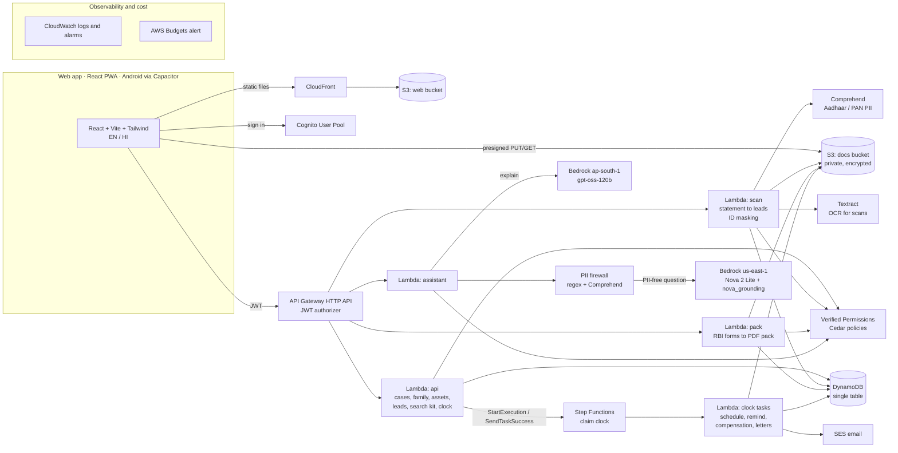
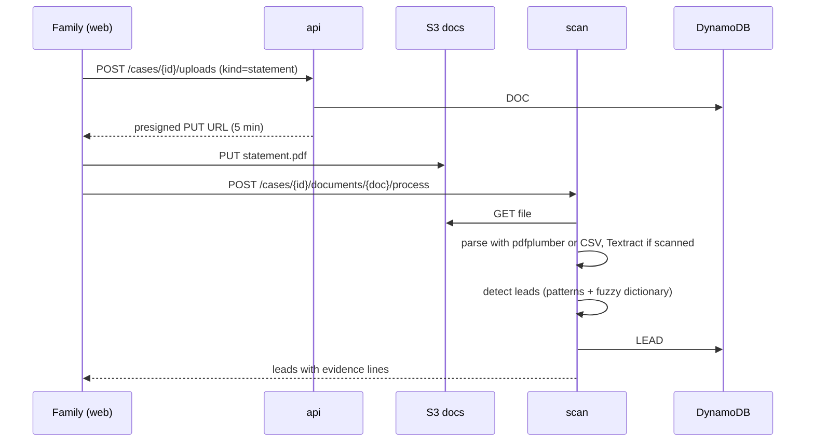
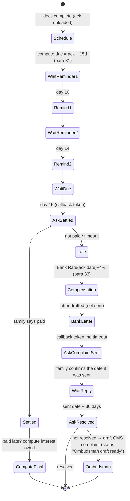

# Architecture: AfterLoss

Region: **ap-south-1 (Mumbai)** for all data and compute. The only exception is web-grounded AI questions, which go to a US region (the only place Nova Web Grounding runs), and only after all personal data is removed.

Everything is serverless and defined in **one AWS SAM template** (`backend/template.yaml`), so a single command deploys it.

---

## 1. System diagram



## 2. AWS services, and why each one

| Need | Service | Why this and not something else |
|---|---|---|
| Host the web app | **S3 + CloudFront (OAC)** | Private bucket, global HTTPS, SPA fallback. Defined in the same SAM stack as everything else. |
| Sign in | **Cognito User Pool** | Email + password with email verification. The JWT works for the web and for a Capacitor Android app. |
| API | **API Gateway HTTP API** + JWT authorizer | Cheaper and simpler than REST API; built-in Cognito JWT check. |
| Business logic | **Lambda (Python 3.13)** | Short request/response work. Four functions split by dependency weight (api / scan / pack / assistant) plus the clock tasks. |
| Who can do what | **Amazon Verified Permissions (Cedar)** | Family roles live as policies, not scattered `if`s. `forbid` always beats `permit`, so "helpers never download originals" can't be undone by a later rule. |
| Data | **DynamoDB (on-demand, single table)** | Every read is "everything for one case" or "my cases" → one partition key plus one GSI; no joins or migrations. |
| Files | **S3 (docs bucket)** | Private, SSE-S3 encryption, public access blocked. Uploads and downloads go directly through 5-minute presigned URLs, so Lambda never carries large files. |
| Weeks-long claim clocks | **Step Functions (Standard)** | A claim waits on people (callback tokens) and on time (Wait states), for up to a year. The execution history is a free audit trail, and it costs cents. A cron job would need its own state and bookkeeping. |
| OCR for scans | **Textract** | Word boxes let us mask Aadhaar precisely. Digital PDFs skip OCR (pdfplumber) to save cost. |
| PII detection | **Comprehend DetectPiiEntities** | Supports `IN_AADHAAR` and `IN_PERMANENT_ACCOUNT_NUMBER`. A second signal after our regex and checksum. |
| AI model | **Bedrock, Amazon Nova 2 Lite** | AWS's own small, fast, cheap model. |
| Web search | **Nova Web Grounding** (`nova_grounding` system tool) | Built-in search with citations, and queries stay within AWS. It only runs via US cross-region profiles, so we send only PII-free questions. |
| Email | **SES** | Day-10 and day-14 reminders (sandbox: verified recipients only). |
| Monitoring | **CloudWatch** + **AWS Budgets** | Logs, error alarms, and a monthly spend alert. |

**What we chose not to use, and why (cost decisions are scored in Ship It):**
- **OpenSearch Serverless** for fuzzy-matching company names: it has a minimum always-on capacity charge. Our dictionary is about 3,000 rows, so `rapidfuzz` inside Lambda does the same job for ₹0. OpenSearch becomes worth it once we index full documents at scale.
- **SMS reminders:** India requires TRAI DLT registration (entity and template IDs) before business SMS, which takes days. We use email and in-app now; WhatsApp through AWS End User Messaging comes later.
- **Amplify Hosting:** fine, but S3 + CloudFront keeps the whole system in one IaC template.

## 3. Main flows

### 3.1 Find assets from a bank statement



Unclear lines can get a **suggested** category from Nova (on the ap-south-1 model). Every lead needs a human to confirm it before it becomes an asset.

### 3.2 Confirm lead → asset → route

`POST /cases/{id}/leads/{lead}/confirm` → creates an `ASSET#` item → the **rules engine** (plain Python) evaluates the rule files in `backend/src/afterloss/rules/data/*.json` → returns the route, required documents, forms, the rule quote and paragraph, and warnings.

### 3.3 Generate a claim pack

`POST /cases/{id}/assets/{asset}/pack` → the pack Lambda loads the family profile and people, fills the route's Annex forms (reportlab), adds the masked attachments from S3, a cover checklist, signature boxes and page numbers (pypdf) → stores `cases/{id}/packs/{pack}.pdf` → returns a presigned GET URL.

### 3.4 Claim clock (Step Functions)



- **Callback tokens** (`.waitForTaskToken`): the task stores its token in DynamoDB. When the family answers in the app, the API calls `SendTaskSuccess`.
- **Real-world events, not assumptions:** the 30-day complaint period starts from the date the family says they **sent** the letter (a drafted letter starts nothing), and "paid" records the date the money actually arrived, so an answer given late doesn't make an on-time payment look late.
- **Demo mode:** each case has `secondsPerDay` (86,400 normally, e.g. 4 in demo). The clock Lambda turns "day N" into real timestamps for the `Wait` states' `TimestampPath`, so 15 days can pass in 1 minute on camera.
- Compensation uses the **Bank Rate on the documents-complete date**, as para 33 says. Rates live in `bank_rate.json` with effective dates and sources.

### 3.5 Assistant with web search

0. **Async job** (added 19 Sep): web-grounded answers can take longer than API Gateway's 30-second cap, so `POST /assistant` saves a pending job (DynamoDB, TTL 1 day), re-invokes the same Lambda asynchronously and returns `202 {jobId}`; the app polls `GET /assistant/{jobId}`. If web search fails, a plain Nova answer is returned with a "no live sources" note; if the model fails, the rule text.
1. `POST /assistant {caseId, question, mode, lang}` → Cedar check → **PII firewall**:
   - regex for Aadhaar (12 digits, checksum), PAN, phone numbers, emails and long account numbers
   - Comprehend PII detection
   - known names from the case (deceased, people) are replaced with neutral words ("my father")
2. `mode=explain` → **OpenAI gpt-oss-120b in ap-south-1** (so explanation requests stay in India; `reasoning_effort: low`, 1,200-token cap for its reasoning) with the route as context: the rule's quote, the threshold, the documents, and **the official form facts** (which annexes must be stamped, who may sign Annex I-E). The prompt forbids claims the context doesn't support; Hindi answers get a small glossary. If the model fails, the rule's own label is shown instead. Chosen on 19 Sep after a head-to-head on our prompts (see LEARNINGS).
3. `mode=web` → Nova 2 Lite (`us.amazon.nova-2-lite-v1:0`, us-east-1) with `toolConfig.tools=[{systemTool:{name:"nova_grounding"}}]` → text plus `citationsContent`. Each citation's domain is checked against an allowlist of official sites and labelled official or unverified. **Citations are always shown** (an AWS usage requirement).
4. The answer is logged without PII. Answers never change routes, dates or money.

## 4. Data model (DynamoDB single table `Main`)

| PK | SK | Item | Key attributes |
|---|---|---|---|
| `CASE#<caseId>` | `META` | Case | deceasedName, dod, dob?, panLast4?, pan (encrypted field, optional), leadEmail, secondsPerDay, createdAt |
| `CASE#<caseId>` | `MEMBER#<email>` | App user in the case | role (lead/heir/helper), status (invited/active), name. **GSI1PK=`USER#<email>`, GSI1SK=`CASE#<caseId>`** |
| `CASE#<caseId>` | `PERSON#<personId>` | Claimant or heir used in forms | fullName, relation, address, phone, idType, idLast4, isClaimant, isNonClaimantHeir |
| `CASE#<caseId>` | `LEAD#<leadId>` | Possible asset | type, institution, evidence[], confidence, status (new/confirmed/dismissed), sourceDocId |
| `CASE#<caseId>` | `ASSET#<assetId>` | Asset or claim | type, institution, bankType, nominee (none/nominee/survivor), amount, will, dispute, route, ruleIds, status, clock{ackAt, dueAt, settledAt, amountReceived}, executionArn |
| `CASE#<caseId>` | `DOC#<docId>` | File | kind, s3Key, maskedKey?, contentType, uploadedBy, sha256 |
| `CASE#<caseId>` | `TOKEN#<assetId>#<stage>` | Step Functions callback token | taskToken, createdAt |
| `CASE#<caseId>` | `EVENT#<iso-ts>#<id>` | Timeline entry | type, text, assetId?, actor |

Access patterns: case dashboard = `Query PK=CASE#id` (one call); my cases = `Query GSI1 PK=USER#email`.

## 5. API (HTTP API, all JWT-protected)

| Method and path | Function | Purpose |
|---|---|---|
| `GET /me/cases` | api | My cases |
| `POST /cases` | api | Create a case (caller becomes lead) |
| `GET /cases/{caseId}` | api | Full case view (meta, members, people, leads, assets, docs, events) |
| `PATCH /cases/{caseId}` | api | Update case facts or demo speed |
| `POST /cases/{caseId}/members` | api | Invite by email with a role |
| `PUT /cases/{caseId}/people/{personId}` | api | Add or update a claimant/heir for forms |
| `POST /cases/{caseId}/uploads` | api | Presigned PUT for a new document |
| `GET /cases/{caseId}/documents/{docId}/url` | api | Presigned GET (original or masked, per Cedar) |
| `POST /cases/{caseId}/documents/{docId}/process` | scan | Statement → leads; ID image → masked copy |
| `POST /cases/{caseId}/leads/{leadId}/confirm` / `dismiss` | api | Lead → asset (runs the rules) |
| `POST /cases/{caseId}/assets` / `PATCH .../{assetId}` | api | Add or edit an asset, then re-route |
| `GET /cases/{caseId}/search-kit` | api | Prefilled official searches |
| `POST /cases/{caseId}/findings` | api | Record a search result (→ lead) |
| `POST /cases/{caseId}/assets/{assetId}/pack` | pack | Build the PDF pack |
| `POST /cases/{caseId}/assets/{assetId}/submit` | api | Documents complete → start the clock |
| `POST /cases/{caseId}/assets/{assetId}/answer` | api | Answer a clock question (paid? resolved?) → SendTaskSuccess |
| `POST /assistant` | assistant | Explain or web question |

## 6. Rules engine (rules as data)

- Files: `backend/src/afterloss/rules/data/*.json`. Each rule has: `id`, `applies_to`, `when` (facts), `check` (operator/value), `route` or `effect`, `documents`, `forms`, `source {doc, para, quote, url, sha256}`, and `effective_from`.
- The engine is ~200 lines of plain Python with **unit tests for every rule and edge case** (threshold boundary, co-op vs commercial bank, will, dispute, joint account, locker).
- Source PDFs sit in `sources/` with SHA-256 hashes. `python -m afterloss.rules.verify` re-hashes them and checks that every rule quote appears in its source text.

## 7. Discovery engine

- **Parsers:** CSV; digital PDF (pdfplumber text lines → date, narration, debit/credit, balance); scanned PDF or images (Textract, P1).
- **Detectors** (ordered patterns + dictionaries): dividend → shares; SIP/AMC/RTA (CAMS, KFintech, BSE StAR MF/ICCL) → mutual fund; premium + insurer → insurance; EMI/loan → liability plus "check loan insurance"; FD/RD interest → deposit; PPF/NPS/SSY/SCSS → government scheme; salary → employer (PF/UAN, group insurance); broker → demat.
- **Fuzzy matching** (`rapidfuzz`) against bundled lists: listed companies, AMCs, insurers, banks.
- **Lead:** `{type, institution, evidence[{date, narration, amount}], confidence, next_steps[], portals[]}`; related lines are merged (e.g. 12 SIP debits → 1 lead).

## 8. Forms engine

- **Official pages, not look-alikes.** `forms/official.py` prints the family's details onto the official blank Annex I-A to I-H (SBI's published copy of RBI's standard formats, SHA-256 checked at runtime). `scripts/build_form_layout.py` measured every blank, table cell, tick box and word once, using the glyphs' real baselines (the template's font reports offset glyph boxes). Values are printed in blue ink; tick boxes are ticked; "*Delete whichever is not applicable" options are struck through; amounts are also written in words (lakh / crore); dates are DD-MM-YYYY.
- The reportlab re-typesetting (`annex.py`) remains as a fallback.
- **Other assets** (`claim_letter.py`): a plan sheet (steps, documents, where, timeline, sources) and a pre-filled death intimation and claim letter carrying every identifier the institution's own form asks for (folio, BO ID, policy, UAN, PRAN…).
- **Pack** = cover sheet (checklist, where to submit, originals to carry, "please give dated acknowledgement (para 29)"), forms, attachments (masked, labelled, with "self-attest here"), signature boxes, page numbers and a footer disclaimer.
- The official PDFs are kept in `sources/` for reference and hashing.

## 9. Security and privacy

- **Authentication:** Cognito; the API rejects requests without a valid JWT.
- **Authorization:** every handler calls Verified Permissions `IsAuthorized(principal=User::email, action, resource)` with the case's members passed as entities. Policies are in `backend/policies/*.cedar`. The key guardrails are `forbid` rules: helpers can't download originals; only the lead manages members.
- **S3:** public access blocked, SSE-S3 encryption, TLS enforced by bucket policy, CORS limited to our origins (CloudFront, `http://localhost:5173`, `https://localhost` for Capacitor), presigned URLs valid 5 minutes.
- **PII:** only the last 4 digits of Aadhaar/PAN are stored; images are masked; no PII in logs; web questions are PII-free; a case can be deleted with all its files.
- **IAM:** one role per function with only the actions it needs (e.g. only the assistant can call Bedrock; only the api can start or resume executions).
- **Threats considered:** another family's case (Cedar check on every request), prompt injection from web results (the answer is display-only, never executed), forged acknowledgement dates (they're the family's own evidence; the pack shows the source image).

## 10. Frontend

- React + Vite + TypeScript, Tailwind CSS, react-router, i18next (EN/HI), `aws-amplify/auth` for Cognito.
- Screens: Sign in → My cases → Case home (dashboard) → **Find** (upload, leads board, search kit) → **Assets** (route card with citation, checklist, pack, clock) → **Family** → **Assistant**.
- Mobile-first layout (360px and up), PWA manifest.
- **Android:** Capacitor wraps the same `dist/` build (`npx cap add android` → Android Studio → APK). The API URL and Cognito IDs come from `config` at build time. Camera capture uses the `<input capture>` file picker, which works in the WebView.

## 11. Deployment

```text
backend/  sam build  →  sam deploy (stack: afterloss, region ap-south-1)
frontend/ npm run build → aws s3 sync dist s3://<web-bucket> → CloudFront invalidation
```

Python dependencies go into a Lambda layer built with `pip install --platform manylinux2014_x86_64 --only-binary=:all:`, so builds on Windows produce Linux-compatible wheels without Docker. Stack outputs (API URL, user pool IDs, bucket names) are written to `backend/stack-outputs.json` by `scripts/deploy-backend.ps1`, and the frontend reads the same values from `frontend/.env.production` (see [Deployment](DEPLOYMENT.md)).

## 12. Cost at demonstration scale

Lambda, API Gateway, DynamoDB, Step Functions, Cognito and CloudFront stay within free tiers or cost cents. Textract, Comprehend and Bedrock are pay-per-use at a few cents. An **AWS Budgets alert at $20/month** warns before anything surprising. Expected total for a demonstration deployment: **under $5**.

## 13. Running on open-source equivalents

| Cloud | Local |
|---|---|
| Lambda + API Gateway | `sam local start-api` |
| DynamoDB, S3, Step Functions | LocalStack |
| Verified Permissions | Cedar policies evaluated with the open-source Cedar engine (`cedarpy`) |
| Bedrock Nova | Strands Agents SDK with Ollama |
| Textract | pdfplumber / Tesseract |

This is roadmap, not required for Ship It. The rules engine, discovery and forms are plain Python and already run locally in tests.

## 14. Failure modes

| Failure | Behaviour |
|---|---|
| Model timeout or error | Static explanation from the rule label; web mode says "couldn't search right now" |
| Statement layout not recognised | Show the lines we couldn't read; offer the CSV route; suggest categories with the model |
| Family never answers "paid?" | Timeout → treated as not paid → the family is prompted again, never escalated silently (they approve every letter) |
| Bank Rate data stale | The UI shows the rate used with its effective date and source link |
| Step Functions execution fails | Retries with backoff; errors land in CloudWatch; the asset shows "clock paused, restart" |

## 15. What changes at scale

- Async Textract plus an SQS queue for large scanned uploads.
- OpenSearch for full-text search across documents.
- WhatsApp reminders (AWS End User Messaging Social); SMS after DLT registration.
- Separate Cedar policy stores per tenant (NGOs or legal-aid clinics helping many families).
- Bank-specific form layouts and online lodgement where banks offer it (para 30).
