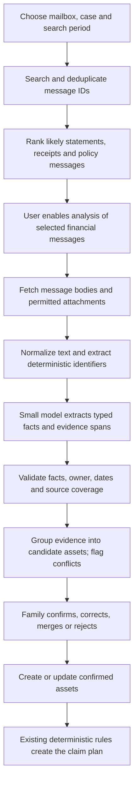

# AfterLoss: product review and email extraction implementation plan

Reviewed 19 September 2026 against commit `855180c`.

Scope: review and implementation plan. The review itself made no cloud or deployed-data changes. A first local implementation pass has since completed the main correctness, follow-up, Gmail evidence/reliability and responsive-navigation foundations described in slices 1–3 and 6. The consented server-side body-extraction/LLM job in slices 4–5 remains a separate release gate; it is not silently enabled by the metadata scanner.

## 1. Assessment

AfterLoss has a useful core: document discovery, sourced rules, official-form overlays, bilingual screens, and a durable follow-up workflow. The remaining gap is the connection between those components. Several screens and backend states treat an institution hint as an asset, a configured form as a completed document, or a generated letter as a sent complaint.

A family needs to know: what belongs to the deceased, how confident we are, what is missing for this particular claim, and what happened outside the app. Those facts should drive the experience.

The recommended investment order is:

1. Correct claim identity, recipients, access, and real-world status tracking.
2. Bring discovery into the first few minutes and make findings reviewable.
3. Add evidence-backed email extraction with a small model.
4. Make each claim a short sequence of specific actions, with shared documents and family assignments.
5. Evaluate with varied documents and unfamiliar users before expanding asset categories.

## 2. Evidence and limits

This review inspected frontend setup, discovery, Gmail, family, navigation, claim plans and tracking; backend services, rules, packs, scanning, authorization and clocks; the source manifest; and the existing tests. The live public entry screen was inspected. The available browser was signed out, so authenticated UI behavior was traced through the code rather than represented as a completed browser usability study.

Earlier in this conversation, this checkout passed 110 backend tests, the frontend build, Gmail classifier checks and 27 stored-source quotation checks. This pass added isolated Node/Python diagnostic examples using synthetic data and the in-memory store. No real inbox was accessed and no paid model benchmark was run.

The following are reproduced software behaviors, not hypothetical concerns:

| Synthetic input | Actual result |
| --- | --- |
| An HDFC Life marketing message saying to buy a new plan | Creates a `life_insurance` finding |
| Two HDFC Life messages naming different policy numbers | Produces one institution-level finding |
| Compare HDFC Bank with HDFC Life, or HDFC Securities | `sameInstitution()` returns `true` for both |
| Two accounts naming different nominees; both people marked nominees in Family | Both names appear in each account's pack context |
| Two separate non-nominated ₹9 lakh deposits at the same commercial bank | Both independently receive `SIMPLIFIED` routes; no aggregate is calculated |
| Record ₹2.5 lakh received for an insurance asset | Case dashboard still reports ₹0 received |
| Change a pack-ready account to have a restraining court order | Route becomes `BLOCKED_BY_COURT`, while status remains `pack_ready` and the old pack link remains |
| Load a case as an authorized helper | Response includes full claimant payment-account numbers |
| Submit an asset update with amount `-100` | API raises a validation error, but `-100` is already persisted |

The deposit example demonstrates missing aggregation relative to the repository's own stored rule text. The correct grouping, interest date, bank-specific higher limits and legal interpretation require domain review; do not fix it by indiscriminately summing every product at a bank. The RBI website could not be freshly retrieved during this pass. Quote hashes prove fidelity to stored text, not that its interpretation or currency is correct.

## 3. Fixes that should precede more features

### P0: Claim recipients must belong to the claim

`backend/src/afterloss/app/service.py:577` selects all case-level nominees and claimants for every pack. The asset's `nomineeName` does not determine these people. `frontend/src/components/People.tsx:193` presents nomination as a global toggle.

Example: the spouse is nominee for Bank A and the daughter for Bank B. Both currently appear in both pack contexts. This is a substantive paperwork problem even when PDF generation succeeds.

Keep the shared people directory, but give each claim explicit `nomineePersonIds`, `claimantPersonIds`, `nonClaimantPersonIds`, guardian relationships and payment instructions. Support nominee allocation/order only where the applicable instrument requires it. Display the selected people immediately before creating a pack. A name extracted from email is a suggestion, not a verified nomination.

Acceptance: two claims with different nominees produce different correct recipient tables; a minor uses the correct guardian; an unrelated person's ID is not attached; missing or conflicting recipient selection blocks a final pack while allowing a clearly marked draft.

### P0: Statuses must follow evidence and actual events

`frontend/src/pages/ClaimDetail.tsx:138` counts a form as ready simply because its form identifier appears in the route. It may not yet have been generated, checked, signed or stamped. `backend/src/afterloss/app/service.py:335` preserves `pack_ready` even after a material route change.

Separate `routeStatus`, `preparationStatus` and `submissionStatus`. Track documents as missing, uploaded, checked, needs correction, ready to sign and signed. Keep branch-only steps distinct. A draft is useful even with blanks, but it should not be labelled ready to submit.

Give each pack an input revision/hash, rule version and generation timestamp. Changing a claimant, account, will, amount or required form should mark affected packs outdated. Preserve previously submitted versions for the history.

Acceptance: a missing signature cannot contribute to submission readiness; an edited nominee invalidates the old pack; a blocked route cannot appear ready to submit; printing a draft remains possible with a visible missing-items list.

### P0: Fix complaint and settlement tracking

`backend/src/handlers/clock.py:119` sets `bankLetterDate` when creating the draft and immediately schedules the reply wait. There is no intervening event confirming that the family sent or delivered the complaint. The state machine can also progress after human-response timeouts. The `escalated` UI label says the claim has reached the Ombudsman even when only a draft exists.

Introduce separate events for `complaint_drafted`, `complaint_sent`, `complaint_received`, `bank_replied`, `ombudsman_draft_ready` and `ombudsman_filed`. Derive eligibility and timers from the applicable event required by the rule, with its evidence and date. An unanswered prompt should retain an unknown outcome and generate a reminder, not silently assert that an institution failed to resolve it.

`frontend/src/pages/ClaimDetail.tsx:620` sends a payment confirmation without `paidOn`; the backend substitutes today's date. A family answering late can therefore record an on-time payment as late. Ask for the actual receipt date, allow partial payments and permit recording payment at any stage. Currently the main payment controls only appear when the callback is waiting.

Acceptance: a drafted but unsent letter starts no complaint-response timer; a payment received on day 12 and recorded on day 18 uses day 12; partial payments retain an outstanding balance; draft and filed complaints have different labels.

### P0: Close the actual privacy gaps

`backend/src/afterloss/app/service.py:206` returns the same people and financial fields to a helper as to family members. Cedar denies original-file downloads, but that does not redact API JSON or generated packs. `backend/src/handlers/api.py` treats generated packs as previews, which can include full payment details.

Use role-aware response projections and explicit generated-document policies. Decide what a helper needs for an assigned task, redact other fields on the server and generate a separate redacted preview where necessary.

`frontend/src/components/EmailFinder.tsx:25` stores tokens and findings in a module-global array. It is not scoped to the app user or case. `frontend/src/lib/auth.ts` signs out without clearing it. Findings can carry across case navigation, and a same-page sign-out/sign-in can retain the prior session's Gmail state.

Scope email sessions to the signed-in user and selected case. Clear tokens, findings and in-flight results on sign-out; invalidate work when ownership changes; abort fetches on disconnect. Revoke permissions where appropriate rather than merely hiding cards.

Acceptance: a helper receives no unapproved full account numbers via JSON or generated PDFs; changing app users exposes no prior user's Gmail results; a scan completing after disconnect cannot repopulate them.

### P0/P1: Correct grouping, validation and production defaults

- **Bank aggregation:** `facts_for()` at `service.py:320` supplies only the current asset amount. Introduce institution IDs and a reviewed claim-grouping policy before applying aggregate thresholds. Keep nomination categories and bank-specific rules explicit.
- **Validate before saving:** `update_asset()` at `service.py:393` writes data before evaluating the route. Validate the entire candidate state first; write its facts and route together with a revision condition. Add idempotency to pack and clock creation.
- **Demo isolation:** `frontend/src/pages/CasesPage.tsx:80` defaults new cases to demo speed. Default ordinary cases to real time. Provide a separate synthetic demo case and persistent demo markings, including generated output.
- **Unknown facts:** missing will/dispute answers currently become false in `facts_for()`. Preserve unknown values until the family answers the material question.

## 4. Why the flow feels less mature than the feature list

### Value arrives too late

The seven-step order collects certificate particulars, family roles and payee accounts before the family discovers assets. Gmail appears under investments, after several input-heavy steps. This is coherent from a form-generation perspective, but it asks for substantial effort before showing a useful result.

Proposed first visit:

1. Enter the deceased's name and relationship; provide the death date when known.
2. Choose an immediate goal: find assets, prepare a known claim, or follow up on a submitted claim.
3. For discovery, choose Gmail, statement, photo or manual entry on one screen.
4. Review extracted assets with evidence and ownership.
5. Choose one claim and complete only its missing requirements.

An experienced family should be able to jump directly to tracking. Someone who has one bank account to claim should not need to finish an investment inventory first. A family unable to access the deceased's inbox needs a complete upload/manual route.

### Use five clear areas

Recommended navigation: **Today, Find assets, Claims, Documents, Family**. Put contextual explanations and guides inside the relevant steps, while keeping search/help available.

The current mobile navigation in `CaseShell.tsx:34` takes the first five desktop entries and omits dedicated Documents, Find and Family navigation. Give those destinations explicit mobile access. Provide an account menu with sign-out on every screen size.

### Show actionable progress

The home page should lead with one achievable task and why it matters:

> HDFC claim: confirm who is named as nominee. The statement does not establish this. About 2 minutes.

Below that, show claims needing the family, claims waiting on an institution, confirmed receipts, and unresolved findings. An approximate asset balance, an insurance sum assured and a confirmed payout should not be added into a single apparently recoverable-money total.

`service.case_view()` currently totals only `clock.amountReceived`, omitting `receivedAmount` on non-bank claims. Correct this and use a common settlement ledger. Apply `include: false` consistently to next actions and selected-claim totals.

### Make document reuse visible

Associate each document with a person, source, pages, verification state and applicable claims. Show “Death certificate — used in 4 claims” and allow a replacement to update all affected readiness checks.

In `backend/src/handlers/pack.py:30`, a PDF attachment is rendered from page zero only. Do not silently lose later pages. `skippedUnmasked` is returned by the API but not surfaced by PackCard; show all omissions before the family prints. Large families also need explicit overflow handling for form tables that currently slice to four people.

### Communicate scan coverage honestly

`backend/src/handlers/scan.py:23` OCRs at most three scanned PDF pages. The frontend nevertheless says “Reading every transaction.” Return pages processed, total pages, statement date coverage, failures and remaining work. Process longer scans asynchronously with visible progress or tell the family exactly what was skipped.

Tests finding 16 planted assets in one synthetic statement demonstrate that scenario, not precision/recall across Indian bank formats.

## 5. Gmail today: what the LLM needs to improve

The current scan in `frontend/src/lib/gmail.ts:116` runs 27 fixed searches. It requests one message for an institution query or 15 for a keyword query, does not paginate, and fetches only From, Subject and Date. Results have no stable message IDs, owner, folio, policy number, evidence location or attachment reference.

Specific consequences:

- Sender presence can represent marketing or account-opening attempts, not ownership.
- An insurer sender can contain several policies; a broker can hold multiple product types.
- CAMS, KFintech and depositories may provide documents concerning multiple underlying institutions or instruments. They should not automatically become the claim destination.
- A family member's inbox can contain their own assets, forwarded mail and messages for several relatives.
- Premium paid is not sum assured; a dividend is not holding value; an FD interest credit is not principal.
- Headers cannot establish present holdings, policy coverage on the date of death, nominee status or claim eligibility.
- `sameInstitution()` at `gmailScan.ts:113` uses prefix matching after stripping terms such as “Bank.” `EmailFinder.tsx:52` uses this without checking product type and can incorrectly disable adding a distinct asset. The choose step has a similar prefix-based filter.
- Query overlap can double-count messages because message IDs are discarded. One query failure can reject the whole account scan instead of retaining successful results.

Google documents pagination and describes `resultSizeEstimate` as an estimate. Implement measured coverage and deduplicate message IDs; do not turn that estimate into evidence of distinct assets. [Gmail list API](https://developers.google.com/workspace/gmail/api/reference/rest/v1/users.messages/list)

## 6. Proposed email extraction pipeline



### Retrieval and parsing

Keep Gmail OAuth tokens in the browser for the first release. Existing `gmail.readonly` permits body retrieval; `messages.get` supports selectable formats. The current metadata-only fetch is an application choice. [Gmail get API](https://developers.google.com/workspace/gmail/api/reference/rest/v1/users.messages/get)

Use pagination with an explicit initial search budget and a “Search older mail” action. For example, start with a visible recent period and broaden when necessary; disclose that old policies can be missed. Do not describe a bounded scan as the whole inbox.

Preserve account ID, message ID, received time, original document date and query source. Fetch plain text where available; safely convert HTML to text without rendering remote images, following links or executing content. Preserve table structure and forwarded-message boundaries. Support `.eml` and manually supplied documents as fallbacks.

Add selected PDF/CSV attachment processing after body extraction works. Handle encrypted PDFs by requesting the password locally; never log it or send it to the LLM. Report unreadable/encrypted/skipped attachments. CAS parsing should identify holders, folios, AMCs, schemes and valuation dates; it warrants its own evaluated parser.

### Model responsibility

Use one narrow extraction request per message or small related-document group. It should classify message purpose and propose fields together, without separate conversational agent steps.

Allowed outputs include asset evidence, marketing, service notice, transaction only, wrong owner, insufficient evidence and unsupported document. Unknown fields are `null`. The model cannot create claims, call URLs, follow instructions found in emails, calculate legal entitlements or infer current coverage from an old premium receipt.

Separate fields for `premiumPaid`, `sumAssured`, `accountBalance`, `principal`, `maturityValue`, `dividendPaid`, `holdingValue`, `units` and their effective dates. Avoid pushing all extracted numbers into `asset.amount`.

Use deterministic extraction and validation for IFSC, dates, account/folio/policy identifiers, money formats and identifier masking. Where practical, replace complete IDs with stable placeholders before the model call and restore their verified values in the browser. Do not strip information required for ownership matching and then claim the model verified the owner.

Every populated field must cite a real source location. Verify that the quoted span occurs in the normalized input and contains or supports the value. A model's self-reported confidence is not a calibrated probability. Compute review requirements from evidence strength, consistency, validation and ownership ambiguity.

Illustrative validated candidate, using synthetic data:

```json
{
  "schemaVersion": 1,
  "candidateId": "candidate_01",
  "assetType": "life_insurance",
  "institutionId": "hdfc_life",
  "owner": { "name": "Synthetic Parent", "match": "needs_confirmation" },
  "identifiers": { "policyNumberToken": "POLICY_1", "policyLast4": "4321" },
  "values": {
    "premiumPaid": { "amount": 12500, "currency": "INR" },
    "sumAssured": null
  },
  "policyStatus": "unknown",
  "nominees": [],
  "evidence": [
    {
      "sourceId": "source_01",
      "field": "values.premiumPaid",
      "quote": "Premium received: INR 12,500",
      "locator": { "kind": "body", "blockId": "block_7" }
    }
  ],
  "missing": ["sumAssured", "nomination", "coverageOnDateOfDeath"],
  "reviewState": "pending"
}
```

The backend generates candidate IDs and validates source IDs; these are not authority supplied by the model. Persist field provenance, extractor/model version, review decisions and conflicts. Keep manually confirmed values authoritative until a person explicitly changes them.

### Identity and merging

Use canonical institution IDs plus asset type, owner, and strong account/folio/policy identifiers. Never merge solely because the institution is similar. Last four digits alone are not a unique key. Keep uncertain matches separate and propose a merge for review.

Distinguish an issuer, bank, AMC, registrar, broker and depository. A company dividend and a demat statement may be evidence of the same underlying holding; do not count both as independently recoverable money. The first version can preserve this relation without calculating a consolidated portfolio total.

### Review screen

Show individual assets, not sender summaries:

> HDFC Life · policy ending 4321  
> Holder: Synthetic Parent — confirm  
> Premium paid: ₹12,500 on 12 August 2026  
> Sum assured: not found  
> Evidence: premium receipt, with the relevant text highlighted  
> Next: check the policy schedule for cover and nominee details

Actions: **Confirm details**, **Edit**, **Belongs to someone else**, **Same as an existing asset**, **Not an asset**. Make “Review 3 uncertain fields” preferable to reopening a blank form. Show exact pages/messages processed and any exclusions.

### Model choice

Benchmark Amazon Nova Micro as a small text-extraction candidate against the existing deployed explanation model and a deterministic baseline. Choose by field correctness, abstention, latency, total cost and allowed processing location; no extraction benchmark has established a winner yet.

Two current constraints matter: AWS lists Nova Micro without native structured-output support, and Mumbai availability is via geographic inference rather than in-region inference. Do not advertise a Nova Micro solution as guaranteed-schema or Mumbai-only. Its JSON must be parsed and validated, with one bounded retry and a needs-review fallback. If India-only processing is a requirement, use a model confirmed for in-region operation and benchmark it there. [Nova Micro model card](https://docs.aws.amazon.com/bedrock/latest/userguide/model-card-amazon-nova-micro.html)

For a different model with supported structured outputs, use the exact supported API and schema subset. Schema compliance still does not prove factual correctness. [Bedrock structured outputs](https://docs.aws.amazon.com/bedrock/latest/userguide/structured-output.html)

Do not build a vector database or fine-tune a model for the first extraction release. A narrow schema, representative examples, source evidence and an evaluation set are the initial requirements.

### Consent and data handling

The current UI promises that emails never reach the server. Server-side LLM extraction changes that behavior. Before enabling it, explain what selected content goes to AfterLoss/AWS, why, its processing location, retention and how to remove it. Keep the existing metadata/manual route available.

Google treats `gmail.readonly` as restricted. Its guidance says server storage or transmission of restricted-scope data requires a security assessment. Review applicability to the existing saved derived data as well as the expanded pipeline; being client-side for OAuth does not remove these requirements. [Gmail scope guidance](https://developers.google.com/workspace/gmail/api/auth/scopes)

Use content only for the visible user-requested feature; do not use mailbox content to train a general model. Protect against prompt injection and document data management controls. Google explicitly covers disclosure, consent, permitted transfers and these limited-use restrictions. [Google Workspace user data policy](https://developers.google.com/workspace/workspace-api-user-data-developer-policy)

Proposed handling: encrypted temporary objects, no request/prompt bodies in logs, narrowly permitted model calls, minimal retained evidence and explicit deletion after extraction. Use TTL/lifecycle only as cleanup backstops; they do not guarantee immediate deletion. Define treatment of retries, failure objects, model logging and backups before making a retention promise.

## 7. Implementation slices

Estimates below are rough engineering effort for one developer familiar with this repository. They exclude external verification, legal review and representative-user testing; they are not delivery commitments.

| Slice | Work and main files | Completion gate | Rough effort |
| --- | --- | --- | --- |
| 1. Correctness foundations | `service.py`, `People.tsx`, `ClaimDetail.tsx`, `CasesPage.tsx`, auth/session handling; claim-specific people, privacy projection, correct totals, real-time default, validate-before-write | Reproduced failures corrected with regression coverage; no changes to confirmed historical facts without review | 2–4 days |
| 2. Honest preparation and follow-up | Pack revisions/readiness, all attachment pages, omission warnings, payment dates and complaint events; `pack.py`, `clock.py`, state machine | A draft cannot masquerade as submitted; edited packs become stale; receipts can be recorded accurately | 2–4 days |
| 3. Retrieval and evidence contracts | `gmail.ts`, `gmailScan.ts`, new email/source types and retrieval tests; paging, message IDs, partial results, cancellation, identity | Two policies stay separate; same message counted once; reconnect resumes safely; coverage visible | 1–2 days |
| 4. Body extraction vertical slice | New backend email extraction service/handler, model adapter, schema validator, temporary-storage lifecycle; infrastructure/IAM | Synthetic messages become evidenced candidates; invalid or injected output creates no asset; quota and retry limits work | 2–3 days |
| 5. Human review and confirmation | `EmailFinder.tsx`, dedicated candidate review, confirm endpoint; reuse `create_asset` only after confirmation | Fields editable beside evidence; ambiguous ownership blocks confirmation; repeated confirmation is idempotent | 1–2 days |
| 6. Earlier discovery and unified dashboard | `SetupPage.tsx`, `CaseHome.tsx`, `CaseShell.tsx`; goal-based entry and per-claim missing facts | New users reach a useful verified finding before payee details; all mobile destinations reachable | 1–2 days |
| 7. Attachments and family coordination | PDF/CAS processing, encrypted-file handling, task owner, document reuse | Multi-page and multi-owner fixtures correct; task completion updates the relevant claim | 3–5 days, depending on formats |

The first convincing email release should handle a few chosen categories well: insurance receipts/policy notices, FD notices and mutual-fund-related messages. Clearly label partial support; do not promise complete CAS portfolio extraction until its attachment parser is evaluated.

### Proposed API and data additions

Keep the existing Lambda/DynamoDB/S3 foundation. Add a dedicated extraction permission and handler so email processing can have separate quotas, model allowlists and logging behavior.

- `POST /cases/{caseId}/email-jobs`: creates an authorized, quota-limited extraction job for selected source content; returns `202` and the bounded upload/job contract. Gmail tokens are never supplied.
- `GET /cases/{caseId}/email-jobs/{jobId}`: returns running, partial, complete, cancelled or failed state and processing counts, with access checks on every read.
- `POST /cases/{caseId}/email-jobs/{jobId}/cancel`: cancels outstanding work and triggers content cleanup.
- `PATCH /cases/{caseId}/candidates/{candidateId}`: records corrected fields/review decisions using expected revision.
- `POST /cases/{caseId}/candidates/{candidateId}/confirm`: validates owner, identity and field state, creates/links the asset once, then runs existing rules.

Potential case-partition records: `EXTRACT#jobId`, `SOURCE#sourceId`, `CANDIDATE#candidateId`, `TASK#taskId`. Store large temporary bodies outside DynamoDB. Tag source records with user/case, content hash, origin, message/attachment identity, processing coverage and deletion state. Candidate and asset revisions must be separate. Enforce idempotency using source fingerprint plus extractor version, scoped to the case.

For short bounded jobs, the existing async Lambda pattern can support the first slice. For larger or resumable attachment batches, use an SQS worker with per-item retry state and a dead-letter path. Never assume a queue or Lambda will deliver a job exactly once. Cap pages, bytes, tokens, concurrent jobs and per-case cost.

## 8. Evaluation and acceptance

Build an initial labelled set of about 150–200 synthetic or explicitly consented/redacted messages/documents. Split by template/institution family so tests are not near-copies of prompts. A small set is a pilot gate, not proof of population-level reliability.

Include marketing; two policies at one insurer; a bank and its insurance affiliate; forwarded family mail; a wrong owner; partial identifiers; stale valuations; closed/cancelled/lapsed products; premiums versus cover; dividends versus holdings; Hindi/English; HTML tables; multiple attachments; encrypted and multi-page PDFs; duplicate messages; unsupported formats; rate limits; timeouts; malformed JSON and malicious instructions in email text.

Measure separately:

- Candidate precision and recall, by asset type and source format.
- Exact identifier, date and amount accuracy; semantic accuracy of the amount type.
- Unsupported-field rate and evidence-span validity.
- Owner-match errors and ambiguous-owner abstentions.
- False merges versus duplicate candidates.
- Fields accepted unchanged, corrections per asset, and time to a confirmed asset.
- Pages/messages processed versus requested, plus cancellation/retry recovery.
- p50/p95 latency, input/output tokens, retries, OCR use and cost per confirmed asset.

Suggested pilot targets: at least 95% candidate precision and 98% identifier/amount precision on the held-out set, reported with denominators and uncertainty; no unsupported field promoted to verified; every populated field traceable; no automatic merge on institution or last-four alone; no real asset creation from failed validation or injected instructions. These are proposed gates, not current measured performance.

Model cost per job is `inputTokens × inputPrice / 1,000,000 + outputTokens × outputPrice / 1,000,000`, plus OCR, retries and infrastructure. Retrieve actual account/region pricing before setting budgets. Optimize cost per correctly confirmed asset rather than only cost per model call.

For product validation, give five unfamiliar participants synthetic cases and observe without coaching. Include one nominee bank claim, two assets at the same institution, a wrong-owner email, an on-time payment recorded late and a complaint drafted but never sent. Record where they hesitate and whether they can identify the next action. Do not interpret five successful sessions as broad validation; use them to remove the first obvious friction.

## 9. Highest-value additions after the fixes

1. **Evidence review:** extracted fields beside source text/page, with ownership and conflicts visible.
2. **Claim readiness check:** one screen listing exactly what prevents submission, who must act and the current pack revision.
3. **Branch visit sheet:** correct forms, copies, originals to carry, signature/stamp checklist, acknowledgement request and a space for the branch reference.
4. **Acknowledgement capture:** extract bank, branch, claim reference, receipt date and missing-document notes; have the user confirm completeness before starting the applicable clock.
5. **Shared family tasks:** assign a document, signature or visit to a named member, with only the access required for that task.
6. **Receipt and partial-payment ledger:** amounts and actual dates across bank and non-bank claims, separate from estimates and compensation requests.
7. **Rule maintenance:** authoritative source/effective dates, versioned decision traces, reviewed updates, and unsupported/stale states. The current Bank Rate file is manually curated and its latest verified entry cites a secondary report; replace this with a maintained primary-source process before treating every result as current.

Avoid expanding into property, vehicles, automated filing, a general-purpose autonomous assistant or many more languages until the core workflow reliably connects evidence, claimants, paperwork and real-world outcomes. The existing AWS architecture is sufficient for the next stage; a broad infrastructure rewrite is not the priority.
